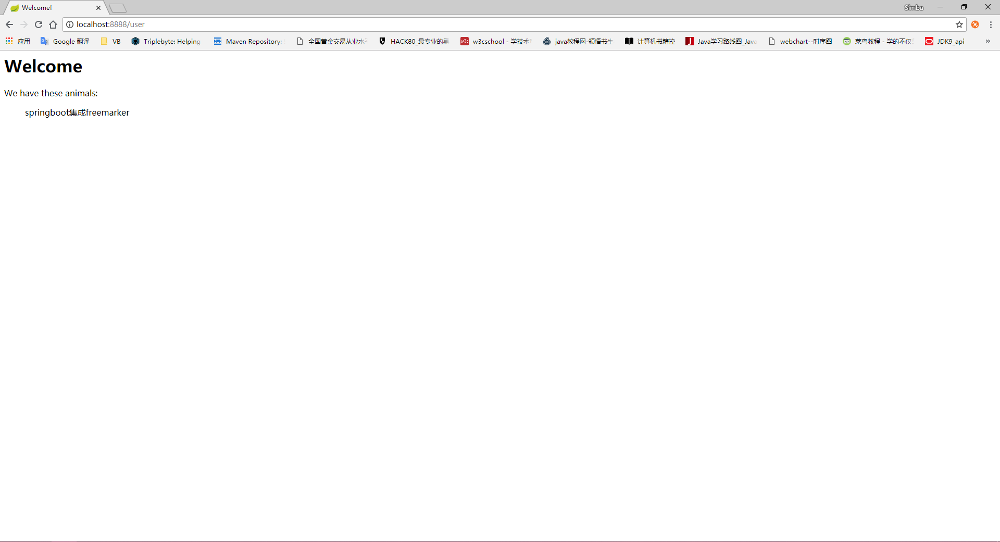

# Springboot 集成 Freemarker

## 网址

Freemarker 官网：https://freemarker.apache.org/

Freemarker 手册网址：http://freemarker.foofun.cn/

spring-boot-starter-freemarker maven地址：http://mvnrepository.com/artifact/org.springframework.boot/spring-boot-starter-freemarker

Freemarker maven地址：http://mvnrepository.com/artifact/org.freemarker/freemarker

## 集成

### 在 pom.xml 添加依赖

```xml
<!--springboot默认支持freemarker,无需添加版本号-->
<!-- freemarker start -->
<dependency>
    <groupId>org.springframework.boot</groupId>
    <artifactId>spring-boot-starter-freemarker</artifactId>
</dependency>
<!-- freemarker end  -->
```

### 项目

####  pom.xml

```xml
<?xml version="1.0" encoding="UTF-8"?>
<project xmlns="http://maven.apache.org/POM/4.0.0"
         xmlns:xsi="http://www.w3.org/2001/XMLSchema-instance"
         xsi:schemaLocation="http://maven.apache.org/POM/4.0.0 http://maven.apache.org/xsd/maven-4.0.0.xsd">
    <modelVersion>4.0.0</modelVersion>

    <groupId>top.simba1949</groupId>
    <artifactId>Springboot-Freemarker</artifactId>
    <version>1.0-SNAPSHOT</version>

    <!-- 继承spring-boot-start-parent -->
    <parent>
        <groupId>org.springframework.boot</groupId>
        <artifactId>spring-boot-starter-parent</artifactId>
        <version>2.0.3.RELEASE</version>
    </parent>

    <!--配置管理-->
    <properties>
        <!--配置项目编码-->
        <project.build.sourceEncoding>UTF-8</project.build.sourceEncoding>
        <!--jdk编译版本-->
        <maven.compiler.source>1.8</maven.compiler.source>
        <maven.compiler.target>1.8</maven.compiler.target>
    </properties>

    <!--依赖管理-->
    <dependencies>
        <!--springboot-web start-->
        <dependency>
            <groupId>org.springframework.boot</groupId>
            <artifactId>spring-boot-starter-web</artifactId>
        </dependency>
        <!--springboot-web  end-->

        <!--springboot test start-->
        <dependency>
            <groupId>org.springframework.boot</groupId>
            <artifactId>spring-boot-starter-test</artifactId>
            <scope>test</scope>
        </dependency>
        <!--springboot test   end-->

        <!-- freemarker start -->
        <dependency>
            <groupId>org.springframework.boot</groupId>
            <artifactId>spring-boot-starter-freemarker</artifactId>
        </dependency>
        <!-- freemarker end   -->
    </dependencies>
</project>
```

#### templates 目录

在 src/resources目录下创建 templates 文件夹，用于放置 freemarker 模板文件

user.ftl 文件

```html
<html>
<head>
    <title>Welcome!</title>
</head>
<body>
    <#-- Greet the user with his/her name -->
    <h1>Welcome</h1>
    <p>We have these animals:
    <ul>
    ${user}
    </ul>
</body>
</html>
```

#### java 代码

启动类 App.java

```java
package top.simba1949;

import org.springframework.boot.SpringApplication;
import org.springframework.boot.autoconfigure.SpringBootApplication;

/**
 * @author simba@onlying.cn
 * @date 2018/7/13 19:38
 */
@SpringBootApplication
public class App {
    public static void main(String[] args) {
        SpringApplication.run(App.class,args);
    }
}
```

UserController.java

```java
package top.simba1949.controller;

import org.springframework.stereotype.Controller;
import org.springframework.ui.Model;
import org.springframework.web.bind.annotation.GetMapping;
import org.springframework.web.bind.annotation.RequestMapping;

/**
 * @author simba@onlying.cn
 * @date 2018/7/13 19:39
 * a.这里不是走 HTTP + JSON 模式，使用了 @Controller 而不是先前的 @RestController
 * b.方法返回值是 String 类型，和 application.properties 配置的 Freemarker 文件配置路径下的各个 *.ftl 文件名一致。这样才会准确地把数据渲染到 ftl 文件里面进行展示。
 * c.用 Model 类，向 Model 加入数据，并指定在该数据在 Freemarker 取值指定的名称。
 */
@RequestMapping("/user")
@Controller
public class UserController {

    @GetMapping
    public String demo(Model model){
        model.addAttribute("user","springboot集成freemarker");
        // 在 templates 目录下多了一层目录 user
        // return "user/user"; // 俩个return都可以
        return "/user/user";
    }
}
```

#### 访问测试

```
http://localhost:8888/user
```

