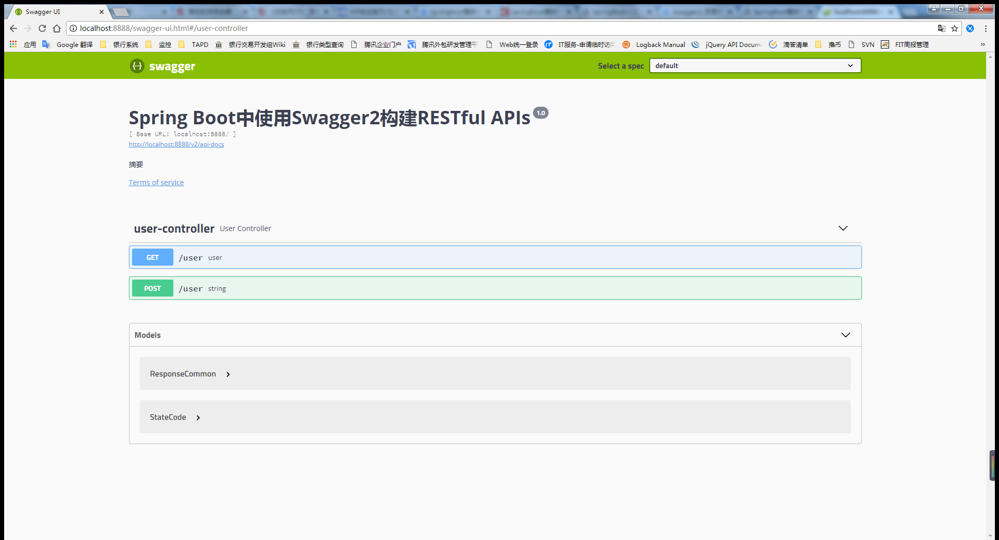

# Springboot集成swagger2

## 官网

swagger2 官网：https://swagger.io/

## maven 地址

springfox-swagger2：http://mvnrepository.com/artifact/io.springfox/springfox-swagger2

springfox-swagger-ui：http://mvnrepository.com/artifact/io.springfox/springfox-swagger-ui

## 在 pom.xml 添加依赖

```xml
<!-- swagger2 start-->
<dependency>
    <groupId>io.springfox</groupId>
    <artifactId>springfox-swagger2</artifactId>
    <version>2.9.2</version>
</dependency>
<dependency>
    <groupId>io.springfox</groupId>
    <artifactId>springfox-swagger-ui</artifactId>
    <version>2.9.2</version>
</dependency>
<!-- swagger2 start-->
```

## 创建 swagger2 配置类

```java
package top.simba1949.config;

import org.springframework.context.annotation.Bean;
import org.springframework.context.annotation.Configuration;
import springfox.documentation.builders.ApiInfoBuilder;
import springfox.documentation.builders.PathSelectors;
import springfox.documentation.builders.RequestHandlerSelectors;
import springfox.documentation.service.ApiInfo;
import springfox.documentation.spi.DocumentationType;
import springfox.documentation.spring.web.plugins.Docket;
import springfox.documentation.swagger2.annotations.EnableSwagger2;

/**
 * Swagger2 配置类
 * @Configuration 让 Spring 容器加载该配置类
 * @EnableSwagger2 用于启动 swagger2
 * @author v_jiayytian@tencent.com
 * @date 2018/7/4 21:36
 */
@Configuration
@EnableSwagger2
public class Swagger2 {
    /**
     * swagger2 启动后，通过createRestApi函数创建Docket的Bean，
     * apiInfo() 用来创建该Api的基本信息（这些基本信息会展现在文档页面中）。
     * select() 函数返回一个ApiSelectorBuilder实例用来控制哪些接口暴露给Swagger来展现，
     * 本例采用指定扫描的包路径来定义，Swagger会扫描该包下所有Controller定义的API，并产生文档内容（除了被@ApiIgnore指定的请求）。
     * @return
     */
    @Bean
    public Docket createRestApi() {
        return new Docket(DocumentationType.SWAGGER_2)
                .apiInfo(apiInfo())
                .select()
                .apis(RequestHandlerSelectors.basePackage("top.simba1949.controller"))
                .paths(PathSelectors.any())
                .build();
    }

    private ApiInfo apiInfo() {
        return new ApiInfoBuilder()
                .title("Spring Boot中使用Swagger2构建RESTful APIs")
                .description("摘要")
                .termsOfServiceUrl("http://localhost:8888/")
                .version("1.0")
                .build();
    }

}
```

运行项目即可

测试访问：http://localhost:8888/swagger-ui.html 

