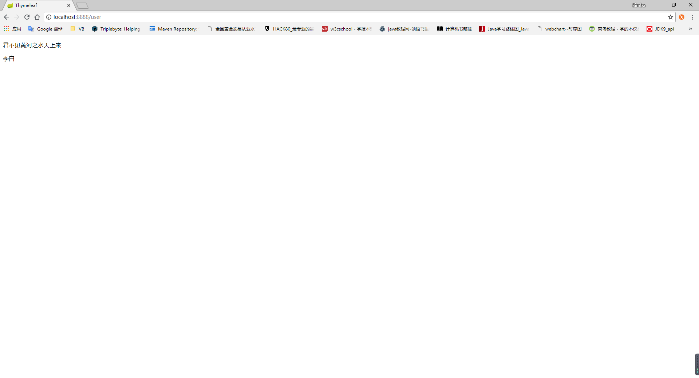

# Springboot集成Thymeleaf

## 网址

Thymeleaf 官网：https://www.thymeleaf.org/

Thymeleaf maven 地址：https://mvnrepository.com/artifact/org.thymeleaf/thymeleaf

spring-boot-starter-thymeleaf maven 地址：https://mvnrepository.com/artifact/org.springframework.boot/spring-boot-starter-thymeleaf

## 集成

在 pom.xml 添加依赖

```xml
<!-- thymeleaf start -->
<dependency>
    <groupId>org.springframework.boot</groupId>
    <artifactId>spring-boot-starter-thymeleaf</artifactId>
    <version>2.0.3.RELEASE</version>
</dependency>
<!-- thymeleaf   end -->
```

## 项目

### pom.xml

```xml
<?xml version="1.0" encoding="UTF-8"?>
<project xmlns="http://maven.apache.org/POM/4.0.0"
         xmlns:xsi="http://www.w3.org/2001/XMLSchema-instance"
         xsi:schemaLocation="http://maven.apache.org/POM/4.0.0 http://maven.apache.org/xsd/maven-4.0.0.xsd">
    <modelVersion>4.0.0</modelVersion>

    <groupId>top.simba1949</groupId>
    <artifactId>Springboot-Thymeleaf</artifactId>
    <version>1.0-SNAPSHOT</version>

    <!-- 继承spring-boot-start-parent -->
    <parent>
        <groupId>org.springframework.boot</groupId>
        <artifactId>spring-boot-starter-parent</artifactId>
        <version>2.0.3.RELEASE</version>
    </parent>

    <!--配置管理-->
    <properties>
        <!--配置项目编码-->
        <project.build.sourceEncoding>UTF-8</project.build.sourceEncoding>
        <!--jdk编译版本-->
        <maven.compiler.source>1.8</maven.compiler.source>
        <maven.compiler.target>1.8</maven.compiler.target>
    </properties>

    <!--依赖管理-->
    <dependencies>
        <!--springboot-web start-->
        <dependency>
            <groupId>org.springframework.boot</groupId>
            <artifactId>spring-boot-starter-web</artifactId>
        </dependency>
        <!--springboot-web  end-->

        <!--springboot test start-->
        <dependency>
            <groupId>org.springframework.boot</groupId>
            <artifactId>spring-boot-starter-test</artifactId>
            <scope>test</scope>
        </dependency>
        <!--springboot test   end-->

        <!-- thymeleaf start -->
        <dependency>
            <groupId>org.springframework.boot</groupId>
            <artifactId>spring-boot-starter-thymeleaf</artifactId>
            <version>2.0.3.RELEASE</version>
        </dependency>
        <!-- thymeleaf  end -->

    </dependencies>
</project>
```

### 配置文件

application.yml

```yaml
server:
  port: 8888
spring:
  # thymeleaf 配置
  thymeleaf:
    # 前缀配置
    prefix: classpath:templates/
    # 后缀配置
    suffix: .html
    # 类型配置
    mode: HTML5
    # thymeleaf 编码配置
    encoding: utf-8
    servlet:
      content-type: text/html
    cache: false
```

### Java 代码

启动类 App.class

```java
package top.simba1949;

import org.springframework.boot.SpringApplication;
import org.springframework.boot.autoconfigure.SpringBootApplication;

/**
 * @author simba@onlying.cn
 * @date 2018/7/14 11:55
 */
@SpringBootApplication
public class App {
    public static void main(String[] args) {
        SpringApplication.run(App.class,args);
    }
}
```


web 层 UserController.class

```java
package top.simba1949.controller;

import org.springframework.stereotype.Controller;
import org.springframework.ui.Model;
import org.springframework.web.bind.annotation.GetMapping;
import org.springframework.web.bind.annotation.RequestMapping;

/**
 * @author simba@onlying.cn
 * @date 2018/7/14 11:56
 */
@RequestMapping("/user")
@Controller
public class UserController {

    @GetMapping
    public String string(Model model){
        model.addAttribute("user","李白");
        return "/user/userlist";
    }
}
```

### templates

在templates目录下创建文件夹user。

userlist.html

```html
<!DOCTYPE html>
<html xmlns:th="http://www.thymeleaf.org">
<head>
    <title>Thymeleaf</title>
</head>
<body>
    <p>君不见黄河之水天上来</p>
    <p th:text="${user}"></p>
</body>
</html>
```

### 访问测试

    http://localhost:8888/user



