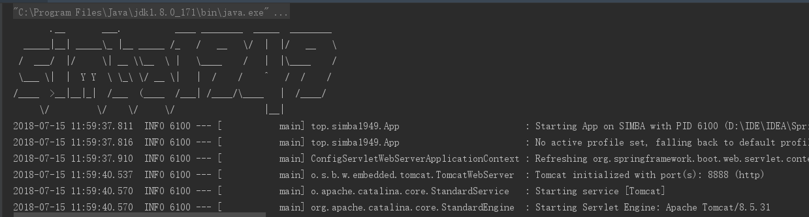
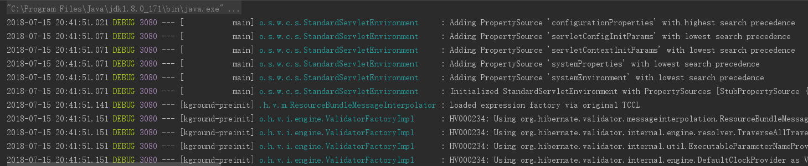
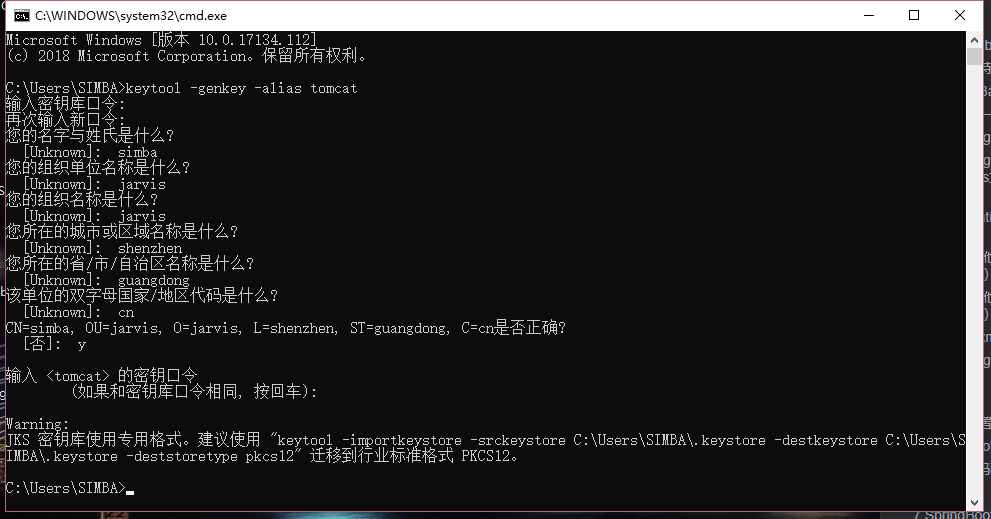
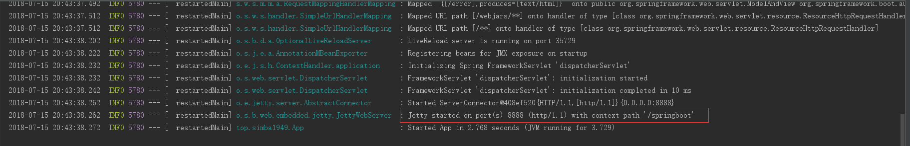
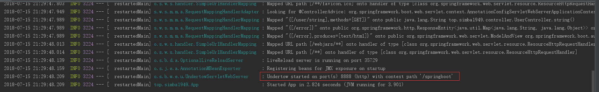
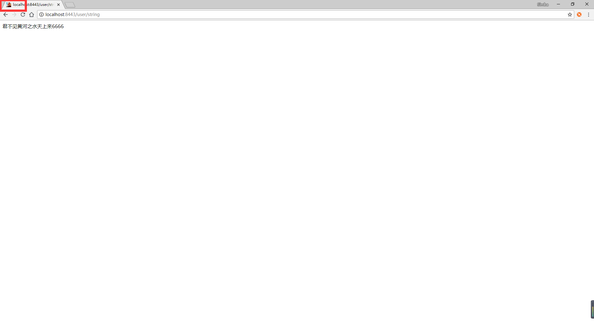

# Springboot学习笔记

## 1.基本配置

### 1.1springboot的入口类

pom.xml 文件配置

```xml
<?xml version="1.0" encoding="UTF-8"?>
<project xmlns="http://maven.apache.org/POM/4.0.0"
         xmlns:xsi="http://www.w3.org/2001/XMLSchema-instance"
         xsi:schemaLocation="http://maven.apache.org/POM/4.0.0 http://maven.apache.org/xsd/maven-4.0.0.xsd">
    <modelVersion>4.0.0</modelVersion>

    <groupId>top.simba1949</groupId>
    <artifactId>Springboot</artifactId>
    <version>1.0-SNAPSHOT</version>

    <!-- 继承spring-boot-start-parent -->
    <parent>
        <groupId>org.springframework.boot</groupId>
        <artifactId>spring-boot-starter-parent</artifactId>
        <version>2.0.3.RELEASE</version>
    </parent>

    <!--配置管理-->
    <properties>
        <!--配置项目编码-->
        <project.build.sourceEncoding>UTF-8</project.build.sourceEncoding>
        <!--jdk编译版本-->
        <maven.compiler.source>1.8</maven.compiler.source>
        <maven.compiler.target>1.8</maven.compiler.target>
    </properties>

    <!--依赖管理-->
    <dependencies>
        <!--springboot-web start-->
        <dependency>
            <groupId>org.springframework.boot</groupId>
            <artifactId>spring-boot-starter-web</artifactId>
        </dependency>
        <!--springboot-web  end-->

        <!--springboot test start-->
        <dependency>
            <groupId>org.springframework.boot</groupId>
            <artifactId>spring-boot-starter-test</artifactId>
            <scope>test</scope>
        </dependency>
        <!--springboot test   end-->
    </dependencies>

    <build>
        <defaultGoal>install</defaultGoal>
        <plugins>
            <!--编译插件-->
            <plugin>
                <groupId>org.apache.maven.plugins</groupId>
                <artifactId>maven-compiler-plugin</artifactId>
                <version>3.7.0</version>
                <configuration>
                    <source>1.8</source>
                    <target>1.8</target>
                </configuration>
            </plugin>
            <!--资源拷贝插件-->
            <plugin>
                <groupId>org.apache.maven.plugins</groupId>
                <artifactId>maven-resources-plugin</artifactId>
                <version>3.0.2</version>
                <configuration>
                    <encoding>UTF-8</encoding>
                </configuration>
            </plugin>
            <!--打包插件-->
            <plugin>
                <groupId>org.springframework.boot</groupId>
                <artifactId>spring-boot-maven-plugin</artifactId>
            </plugin>
        </plugins>
    </build>
</project>
```

启动程序

```java
package top.simba1949;

import org.springframework.boot.SpringApplication;
import org.springframework.boot.autoconfigure.SpringBootApplication;

/**
 * @author simba@onlying.cn
 * @date 2018/7/15 11:55
 */
@SpringBootApplication
public class App {
    public static void main(String[] args) {
        SpringApplication.run(App.class,args);
    }
}
```

@SpringBootApplication是SpringBoot的核心注解，是一个组合注解，源码如下

```java
@Target(ElementType.TYPE)
@Retention(RetentionPolicy.RUNTIME)
@Documented
@Inherited
@SpringBootConfiguration
@EnableAutoConfiguration
@ComponentScan(excludeFilters = {
		@Filter(type = FilterType.CUSTOM, classes = TypeExcludeFilter.class),
		@Filter(type = FilterType.CUSTOM, classes = AutoConfigurationExcludeFilter.class) })
public @interface SpringBootApplication {
   
	@AliasFor(annotation = EnableAutoConfiguration.class, attribute = "exclude")
	Class<?>[] exclude() default {};

	@AliasFor(annotation = EnableAutoConfiguration.class, attribute = "excludeName")
	String[] excludeName() default {};

	@AliasFor(annotation = ComponentScan.class, attribute = "basePackages")
	String[] scanBasePackages() default {};

	@AliasFor(annotation = ComponentScan.class, attribute = "basePackageClasses")
	Class<?>[] scanBasePackageClasses() default {};
}
```

### 1.2 关闭特定的自动配置

关闭特定的自动配置应该使用@SpringBootApplication注解的exclude参数

例：

```
@SpringBootApplication(exclude = {DataSourceAutoConfiguration.class})
```

### 1.3 定制Banner

在springboot启动的时候会有一个默认的启动图案

```
  .   ____          _            __ _ _
 /\\ / ___'_ __ _ _(_)_ __  __ _ \ \ \ \
( ( )\___ | '_ | '_| | '_ \/ _` | \ \ \ \
 \\/  ___)| |_)| | | | | || (_| |  ) ) ) )
  '  |____| .__|_| |_|_| |_\__, | / / / /
 =========|_|==============|___/=/_/_/_/
 :: Spring Boot ::       (v1.5.10.RELEASE)
```

在src/main/resources下新建一个banner.txt，通过http://patorjk.com/software/taag网站生成字符，如敲入simba1949，将网站生成的字符复制在banner.txt中，即可定制



关闭banner

在启动类设置即可，代码如下：

```java
package top.simba1949;

import org.springframework.boot.Banner;
import org.springframework.boot.SpringApplication;
import org.springframework.boot.autoconfigure.SpringBootApplication;

/**
 * @author simba@onlying.cn
 * @date 2018/7/15 11:55
 */
@SpringBootApplication
public class App {
    public static void main(String[] args) {
        SpringApplication application = new SpringApplication(App.class);
        application.setBannerMode(Banner.Mode.OFF);
        application.run(args);
    }
}
```

效果如下：



### 1.4 创建一个可执行的jar

添加打包插件

```xml
<!--打包插件-->
<plugin>
  <groupId>org.springframework.boot</groupId>
  <artifactId>spring-boot-maven-plugin</artifactId>
</plugin>
```

命令运行：mvn package

会得到如下jar包

[INFO] Building jar: D:\Learn\IntelliJ IDEA\Workspace\springboot\springboot01\target\springboot01-1.0-SNAPSHOT.jar

在命令窗口输入下面命令即可运行：

```cmd
java -jar springboot01-1.0-SNAPSHOT.jar
```

### 1.5 SpringBoot的配置文件

springboot使用一个全局的配置文件application.properties或者application.yml，放置在src/main/resources目录下或者类路径/config下

配置端口和访问路径

```yaml
server:
  port: 8888
  servlet:
    # http://localhost:8888/springboot/ 才能访问到
    context-path: '/springboot'
```

### 1.6 Springboot读取properties文件

#### 读取 application.properties 文件

读取properties文件时，需要引入依赖包

```xml
<dependency>
    <groupId>org.springframework.boot</groupId>
    <artifactId>spring-boot-configuration-processor</artifactId>
    <optional>true</optional>
</dependency>
```

在application.properties中添加如下数据

```properties
server.port=8888
server.servlet.context-path=/springboot

#返回页面、数据中文乱码问题
spring.http.encoding.force=true
spring.http.encoding.charset=UTF-8
spring.http.encoding.enabled=true
server.tomcat.uri-encoding = UTF-8
#解决程序读取配置文件乱码问题
spring.message.encoding = UTF-8  

#配置对应的属性
user.username=simba1949
user.age=18
user.flag=true
```

TestProperties.java

```java
package top.simba1949.properties;

import org.springframework.beans.factory.annotation.Value;
import org.springframework.stereotype.Component;

/**
 * @author simba@onlying.cn
 * @date 2018/7/15 14:55
 */
@Component
public class TestProperties {

    @Value("${user.username}")
    String username;
    @Value("${user.age}")
    int age;
    @Value("${user.flag}")
    boolean flag;

    @Override
    public String toString() {
        System.out.println("username" + username);
        System.out.println("age" + age);
        System.out.println("flag" + flag);
        return "TestProperties{" +
                "username='" + username + '\'' +
                ", age=" + age +
                ", flag=" + flag +
                '}';
    }

}
```

#### 读取其他 properties 文件（一）

test.properties 文件

```properties
user.username=simba1949
user.age=18
uset.flag=true
```

TestPropertiess.java 

```java
package top.simba1949.properties;

import org.apache.commons.io.IOUtils;
import org.springframework.beans.factory.annotation.Autowired;
import org.springframework.beans.factory.annotation.Value;
import org.springframework.context.annotation.PropertySource;
import org.springframework.core.env.Environment;
import org.springframework.core.io.Resource;
import org.springframework.stereotype.Component;

import java.io.IOException;

/**
 * @author simba@onlying.cn
 * @date 2018/7/15 15:34
 */
@Component
@PropertySource("classpath:properties/test.properties")
public class TestPropertiess {

    @Value("${user.username}")
    private String username;
    @Value("${user.age}")
    private int age;
    @Value("${user.flag}")
    private boolean flag;
    /**
     * 可以获取文件的流的读写
     */
    @Value("classpath:properties/test.properties")
    private Resource resource;
    /**
     * environment 代表 test.properties 文件，
     * 可以通过 environment.getProperty("user.username") 获取属性值
     */
    @Autowired
    private Environment environment;

    public String output() throws IOException {
        System.out.println(username);
        System.out.println(age);
        System.out.println(flag);
        System.out.println(IOUtils.toString(resource.getInputStream(),"utf-8"));
        System.out.println("environment" + environment.getProperty("user.username"));

        return "username: " + username + "  age: " + age + "  flag: " + flag + "  environment: " + environment.getProperty("user.username")
                + "  resource: "  + IOUtils.toString(resource.getInputStream(),"utf-8");
    }
}
```

#### 读取其他 properties 文件（二）

@Value 注入每一个配置在实际项目中显得格外麻烦，springboot 提供了基于类型安全的配置方式，@ConfigurationProperties 和 @PropertySource 通过前缀自动注入

book.properties

```properties
book.name=springboot
book.age=0
book.flag=true
```

BookProperties.java

```java
package top.simba1949.properties;

import org.springframework.boot.context.properties.ConfigurationProperties;
import org.springframework.context.annotation.PropertySource;
import org.springframework.stereotype.Component;

/**
 * @author simba@onlying.cn
 * @date 2018/7/15 16:02
 * @ConfigurationProperties(prefix = "book") 指定前缀
 * @PropertySource("classpath:properties/book.properties") 指定文件路径
 */
@Component
@ConfigurationProperties(prefix = "book")
@PropertySource("classpath:properties/book.properties")
public class BookProperties {

    private String name;
    private int age;
    private boolean flag;

    public String getName() {
        return name;
    }

    public void setName(String name) {
        this.name = name;
    }

    public int getAge() {
        return age;
    }

    public void setAge(int age) {
        this.age = age;
    }

    public boolean isFlag() {
        return flag;
    }

    public void setFlag(boolean flag) {
        this.flag = flag;
    }

    @Override
    public String toString() {
        return "BookProperties{" +
                "name='" + name + '\'' +
                ", age=" + age +
                ", flag=" + flag +
                '}';
    }
}
```

### 1.7 使用xml配置 //TODO

springboot 提倡零配置，但是在实际项目中，有可能有一些特殊要求必须使用xml配置，这是通过 springboot 提供的 @ImportResource 来加载 xml 配置

```java
@ImportResource({"classpath:ApplicationContext-tran.xml","classpath:ApplicationContext-dao.xml"})
```

### 1.8 Springboot访问静态资源

```
把静态资源放置如下目录，可以直接访问到
*/META-INF/resources
*/resources
*/static
*/public

在 src/resources 目录下创建 static、public、resources 目录，该目录放置静态资源，可以通过

http://IP:PORT/static/fileName.suffixName 访问到，也可以在static目录下添加文件夹一样能访问到

可以直接在浏览器看到：图片，文本，pdf

下载：文件，zip，md，word，xls，
```

## 2.日志配置

在application.properties中配置日志系统，springboot 默认日志框架是 logback

```properties
#日志配置
#日志级别
logging.level.root=DEBUG
logging.level.org.springframework.web=DEBUG
logging.level.org.hibernate=DEBUG
#输出日志名字
#logging.file=springboot001.log
#日志输出路径
logging.path=logs/log.log
```

## 3.Profile配置

Profile是Spring用来针对不同的环境进行不同的配置提供支持的，全局Profile配置实用application-{profile}.properties。

通过在application.properties中设置spring.profiles.active=dev指定活动的Profile。

测试：生产环境端口为80，开发环境端口为8888

生产环境（application-prod.properties）配置如下：

```properties
server.port=80
```

开发环境（application-dev.properties）配置如下：

```properties
server.port=8888
```

application.properties配置：

```properties
spring.profiles.active=dev
```

## 4.SpringBoot运行原理


## 5.http的编码配置

SpringBoot内置的自动配置功能：http的编码配置

在常规项目中配置http编码的时候在web.xml里配置一个filter

```xml
<filter>
    <filter-name>encoding</filter-name>
    <filter-class>org.springframework.web.filter.CharacterEncodingFilter</filter-class>
    <init-param>
        <param-name>encoding</param-name>
        <param-value>UTF-8</param-value>
    </init-param>
    <init-param>
        <param-name>forceEncoding</param-name>
        <param-value>true</param-value>
    </init-param>
</filter>
<filter-mapping>
    <filter-name>encoding</filter-name>
    <url-pattern>/*</url-pattern>
</filter-mapping>
```

自动配置要满足俩个条件

1. 能配置CharacterEncodingFilter这个Bean
2. 能配置encoding和forceEncoding这俩个参数

默认编码方式为UTF-8，若修改可使用spring.http.encoding.charset=编码；

设置forceEncoding，默认为true，若修改可使用spring.http.encoding.force=false

## 6.SSL配置

> SSL：Secure Sockets Layer 安全套接层
>
> 是为了网络通信提供的安全数据完整性的一种安全协议，SSL 在网络传输层对网络连接进行加密。

生成证书：

在控制台输入以下命令，然后按照提示操作即可

```
keytool -genkey -alias tomcat
```

如图示：



生成的 .keystore，如图示


将生成的.keystore文件复制到**项目的根目录**下，然后再application.properties中配饰SSL

```properties
server.ssl.key-store=.keystore
server.ssl.key-password=19491001
server.ssl.key-store-type=JKS
server.ssl.key-alias=tomcat
```


目录结构


## 7.SpringBoot的开发

### 7.1Tomcat配置

springboot默认内嵌Tomcat为servlet容器

配置servlet容器

```properties
######################################配置servlet
#配置程序端口，默认为8080
server.port=8888
#用户回话session过期时间，一秒为单位
#server.servlet.session.timeout=
#配置访问路径，默认为/
server.servlet.context-path=/springboot
```

配置tomcat

```properties
######################################配置Tomcat
#配置Tomcat编码，默认为utf-8
server.tomcat.uri-encoding=utf-8
```

##### 替换为Jetty

```xml
<!--springboot-web start-->
<dependency>
    <groupId>org.springframework.boot</groupId>
    <artifactId>spring-boot-starter-web</artifactId>
    <exclusions>
        <!--替换默认的tomcat-->
        <exclusion>
            <groupId>org.springframework.boot</groupId>
            <artifactId>spring-boot-starter-tomcat</artifactId>
        </exclusion>
    </exclusions>
</dependency>
<!--springboot-web  end-->

<!-- spring-boot-starter-jetty start-->
<dependency>
    <groupId>org.springframework.boot</groupId>
    <artifactId>spring-boot-starter-jetty</artifactId>
</dependency>
<!-- spring-boot-starter-jetty end-->
```

效果如图：



##### 替换为Undertow

```xml
<!--springboot-web start-->
<dependency>
    <groupId>org.springframework.boot</groupId>
    <artifactId>spring-boot-starter-web</artifactId>
    <exclusions>
        <!--替换默认的tomcat-->
        <exclusion>
            <groupId>org.springframework.boot</groupId>
            <artifactId>spring-boot-starter-tomcat</artifactId>
        </exclusion>
    </exclusions>
</dependency>
<!--springboot-web  end-->

<!-- spring-boot-starter-undertow start-->
<dependency>
    <groupId>org.springframework.boot</groupId>
    <artifactId>spring-boot-starter-undertow</artifactId>
</dependency>
<!-- spring-boot-starter-undertow end-->
```

效果如图：



### 7.2Favicon配置

springboot默认开启，关闭favicon在application.properties中配置即可

```properties
spring.mvc.favicon.enabled=false
```

定制Favicon

需要spring.mvc.favicon.enabled开启，不配置默认开启也可，将favicon.ico(文件名不能变动过)放置在类路径 /static、类路径 META-INF/resources、类路径 resources、类路径 static、类路径 public 下即可，运行效果



### 7.3集成springmvc

#### Json Rest实现

在springboot应用中，任何spring@RestController默认渲染为JSON响应

例如：

```java
@GetMapping(value = "/list",produces = "application/json")
    @ResponseBody
    public List<User> list(){
        List<User> users = new ArrayList<User>();
        users.add(new User("李白","诗仙"));
        users.add(new User("杜甫","诗圣"));
        users.add(new User("王维","诗佛"));
        users.add(new User("白居易","诗魔"));
        users.add(new User("李贺","诗鬼"));
        users.add(new User("苏轼","诗神"));
        return  users;
    }
```


#### XML Rest实现

如果classpath下存在Jackson XML扩展（jackson-dataformat-xml） ， 它会被用来渲染XML响应， 示例和JSON的非常相似。想要使用它， 只需为你的项目添加以下的依赖

```xml
<!--Jackson XML扩展包-->
<dependency>
  <groupId>com.fasterxml.jackson.dataformat</groupId>
  <artifactId>jackson-dataformat-xml</artifactId>
</dependency>
```

例如：

```java
@GetMapping(value = "/xml",produces = "application/xml")
    @ResponseBody
    public List<User> xml(){
        List<User> users = new ArrayList<User>();
        users.add(new User("李 白","诗仙"));
        users.add(new User("杜 甫","诗圣"));
        users.add(new User("王 维","诗佛"));
        users.add(new User("白居易","诗魔"));
        users.add(new User("李 贺","诗鬼"));
        users.add(new User("苏 轼","诗神"));
        return  users;
    }
```


#### SpringMVC视图解析器配置

由于springboot已经不推荐使用jsp了，如果想使用jsp，需要手动引入相关依赖包。

```xml
<!-- jsp -->
<dependency>
    <groupId>org.apache.tomcat.embed</groupId>
    <artifactId>tomcat-embed-jasper</artifactId>
    <!-- <scope>provided</scope> -->
</dependency>
<!-- servlet 依赖 -->
<dependency>
    <groupId>javax.servlet</groupId>
    <artifactId>javax.servlet-api</artifactId>
    <!--   <scope>provided</scope> -->
</dependency>
<!-- 添加 JSTL 支持 -->
<dependency>
    <groupId>javax.servlet</groupId>
    <artifactId>jstl</artifactId>
</dependency>
```

在application.properties配置视图解析器

```properties
#视图解析器
spring.mvc.view.prefix=/WEB-INF/view/
spring.mvc.view.suffix=.jsp
```

### 7.4集成MyBatis

pom文件添加依赖

```xml
<dependency>
    <groupId>org.mybatis.spring.boot</groupId>
    <artifactId>mybatis-spring-boot-starter</artifactId>
    <version>1.3.1</version>
</dependency>
<dependency>
    <groupId>mysql</groupId>
    <artifactId>mysql-connector-java</artifactId>
    <version>6.0.6</version>
    <scope>runtime</scope>
</dependency>
```

mybatis在application.properties配置

```properties
#配置数据源
spring.datasource.driverClassName=com.mysql.jdbc.Driver
spring.datasource.url=jdbc:mysql://127.0.0.1:3306/test?serverTimezone=UTC
spring.datasource.username=root
spring.datasource.password=19491001
#表示打印出sql语句
logging.level.com.shyroke.mapper=debug

#mybatis配置
mybatis.mapper-locations=classpath*:top/simba1949/mapper/*Mapper.xml
mybatis.type-aliases-package=top.simba1949.entity
```

还需要在Application配置@MapperScan(basePackages = "top.simba1949.mapper")

```java
@SpringBootApplication
//@mapperscan 指定被扫描的mapper所在的包路径
@MapperScan(basePackages = "top.simba1949.mapper")
public class Application {

    public static void main(String[] args) {
        SpringApplication.run(Application.class);
    }
}
```

### 7.5 集成druid连接池

pom文件添加依赖

```xml
<!--druid连接池-->
<dependency>
  <groupId>com.alibaba</groupId>
  <artifactId>druid</artifactId>
  <version>1.0.20</version>
</dependency>
```

在application.properties配置

```properties
#配置数据源
spring.datasource.type=com.alibaba.druid.pool.DruidDataSource
spring.datasource.driverClassName=com.mysql.jdbc.Driver
spring.datasource.url=jdbc:mysql://127.0.0.1:3306/test?serverTimezone=UTC
spring.datasource.username=root
spring.datasource.password=19491001
#表示打印出sql语句
logging.level.com.shyroke.mapper=debug

# 下面为连接池的补充设置，应用到上面所有数据源中
# 初始化大小，最小，最大
spring.datasource.initialSize=5
spring.datasource.minIdle=5
spring.datasource.maxActive=20
```

### 7.6 声明式事务配置

#### 7.6.1 基于注解

只需要在参与事务控制的方法上加上@Transactional注解即可。

```java
@Transactional
@Override
public void addUser(User user) {
    int acount = userMapper.addUser(user);
}
```

#### 7.6.2 基于xml配置文件

引入aop依赖

```xml
<dependency>
  <groupId>org.springframework.boot</groupId>
  <artifactId>spring-boot-starter-aop</artifactId>
</dependency>
```

xml事务传播特性配置

```xml
<?xml version="1.0" encoding="UTF-8"?>
<beans xmlns="http://www.springframework.org/schema/beans"
       xmlns:xsi="http://www.w3.org/2001/XMLSchema-instance" xmlns:p="http://www.springframework.org/schema/p"
       xmlns:context="http://www.springframework.org/schema/context"
       xmlns:mvc="http://www.springframework.org/schema/mvc" xmlns:tx="http://www.springframework.org/schema/tx"
       xmlns:aop="http://www.springframework.org/schema/aop"
       xsi:schemaLocation="
        http://www.springframework.org/schema/beans
        http://www.springframework.org/schema/beans/spring-beans.xsd
        http://www.springframework.org/schema/context
        http://www.springframework.org/schema/context/spring-context.xsd
        http://www.springframework.org/schema/mvc
        http://www.springframework.org/schema/mvc/spring-mvc.xsd
        http://www.springframework.org/schema/tx
        http://www.springframework.org/schema/tx/spring-tx.xsd
        http://www.springframework.org/schema/aop
        http://www.springframework.org/schema/aop/spring-aop.xsd">


    <!-- 声明式事务AOP配置 -->
    <aop:config>
        <aop:pointcut expression="execution(* top.simba1949.service.impl.*.*(..))" id="tranpointcut" />
        <aop:advisor advice-ref="txAdvice" pointcut-ref="tranpointcut" />
    </aop:config>
    <!-- 事务传播特性配置 -->
    <tx:advice id="txAdvice" transaction-manager="txManager">
        <tx:attributes>
            <tx:method name="add*" propagation="REQUIRED" isolation="DEFAULT"
                       rollback-for="java.lang.Exception" />
            <tx:method name="save*" propagation="REQUIRED" isolation="DEFAULT"
                       rollback-for="java.lang.Exception" />
            <tx:method name="insert*" propagation="REQUIRED" isolation="DEFAULT"
                       rollback-for="java.lang.Exception" />
            <!-- 查询方法 -->
            <tx:method name="query*" read-only="true" />
            <tx:method name="select*" read-only="true" />
            <tx:method name="find*" read-only="true" />
        </tx:attributes>
    </tx:advice>
    <!-- 配置事务管理器 -->
    <bean id="txManager" class="org.springframework.jdbc.datasource.DataSourceTransactionManager">
        <property name="dataSource" ref="dataSource" />
    </bean>
</beans>
```

配置导入

```java
@SpringBootApplication
//@mapperscan 指定被扫描的mapper所在的包路径
@MapperScan(basePackages = "top.simba1949.mapper")
//@ImportResource 导入事务配置
@ImportResource(value = "classpath:spring-aop.xml")
public class Application {

    public static void main(String[] args) {
        SpringApplication.run(Application.class);
    }
}
```

### 7.7 文件上传

配置文件上传属性

```properties
#默认支持文件上传.
spring.http.multipart.enabled=true
#支持文件写入磁盘.
spring.http.multipart.file-size-threshold=0
# 最大支持文件大小
spring.http.multipart.max-file-size=1Mb
# 最大支持请求大小
spring.http.multipart.max-request-size=10Mb
```

java代码

```java
@RestController
@RequestMapping(value = "/upload")
public class UploadController {

    @PostMapping(value = "/image")
    public String image(@RequestParam(value = "userimage")MultipartFile file, HttpSession session) throws  Exception{
        //获取upload目录，不存在就创建
        String realPath = session.getServletContext().getRealPath("upload");
        File path = new File(realPath);
        if(!path.exists()){
            path.mkdirs();
        }
        //上传
        file.transferTo(new File(realPath+"/"+file.getOriginalFilename()));
        return "http://localhost:8080/upload/"+file.getOriginalFilename();
    }
}
```

### 7.8 注册拦截器

#### 7.8.1自定义拦截器

```java
public class UserInterceptor implements HandlerInterceptor {
    @Override
    public boolean preHandle(HttpServletRequest httpServletRequest, HttpServletResponse httpServletResponse, Object o) throws Exception {
        System.out.println("preHandle-------------------------------");
        return true;
    }

    @Override
    public void postHandle(HttpServletRequest httpServletRequest, HttpServletResponse httpServletResponse, Object o, ModelAndView modelAndView) throws Exception {
        System.out.println("postHandle-------------------------------");
    }

    @Override
    public void afterCompletion(HttpServletRequest httpServletRequest, HttpServletResponse httpServletResponse, Object o, Exception e) throws Exception {
        System.out.println("afterCompletion-------------------------------");
    }
}
```

#### 7.8.2 注册拦截器

```java
@Configuration
public class WebRegister extends WebMvcConfigurerAdapter {
    @Override
    public void addInterceptors(InterceptorRegistry registry) {
        registry.addInterceptor(new UserInterceptor()).addPathPatterns("/add");
        super.addInterceptors(registry);
    }
}
```

### 7.9 springboot异常处理

@ControllerAdvice

该注解是spring2.3以后新增的一个注解，主要是用来Controller的一些公共的需求的低侵入性增强提供辅助，作用于@RequestMapping标注的方法上。

@ExceptionHandler

该注解是配合@ControllerAdvice一起使用的注解，自定义错误处理器，可自己组装json字符串，并返回到页面。

```java
@ControllerAdvice
public class ErrorHandlerController {

    @ResponseBody
    @ExceptionHandler(value = Exception.class)
    public String handleGlobalException(Exception e){
        System.out.println("0000000000000000000000------------------00000000000000000000000000"+e.getMessage());
        return "error";
    }
}
```

